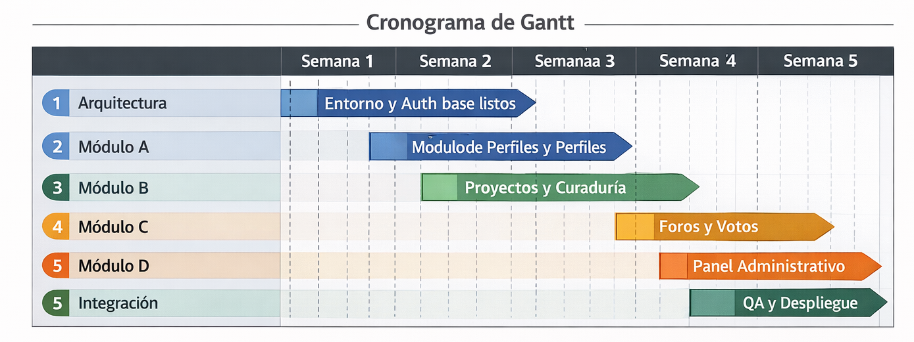
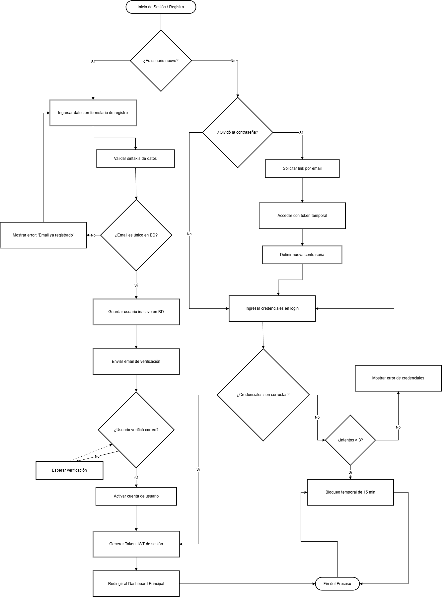
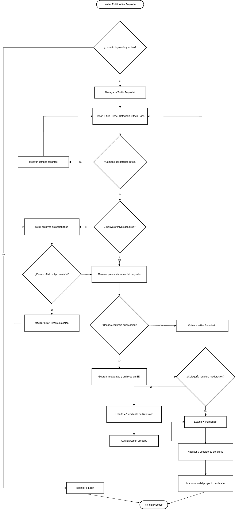
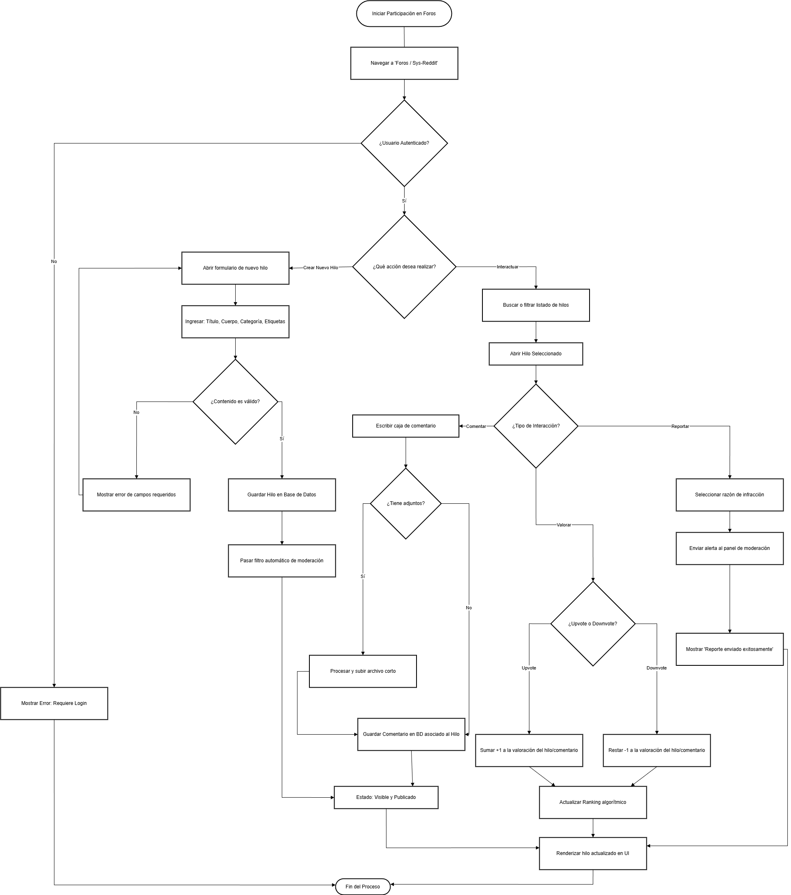
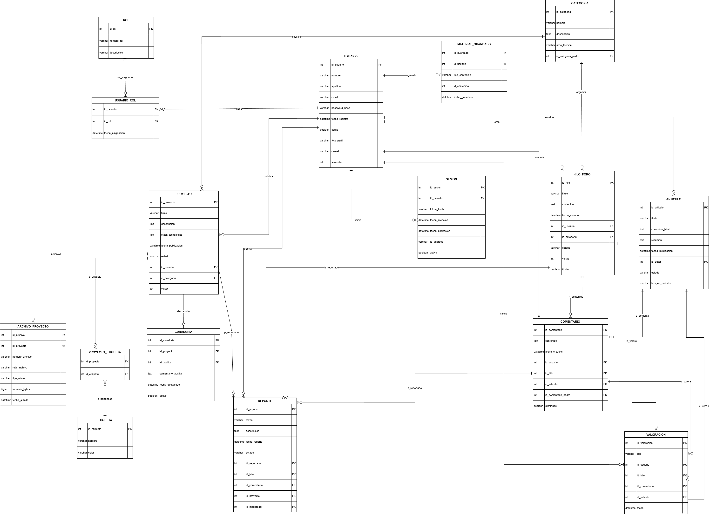
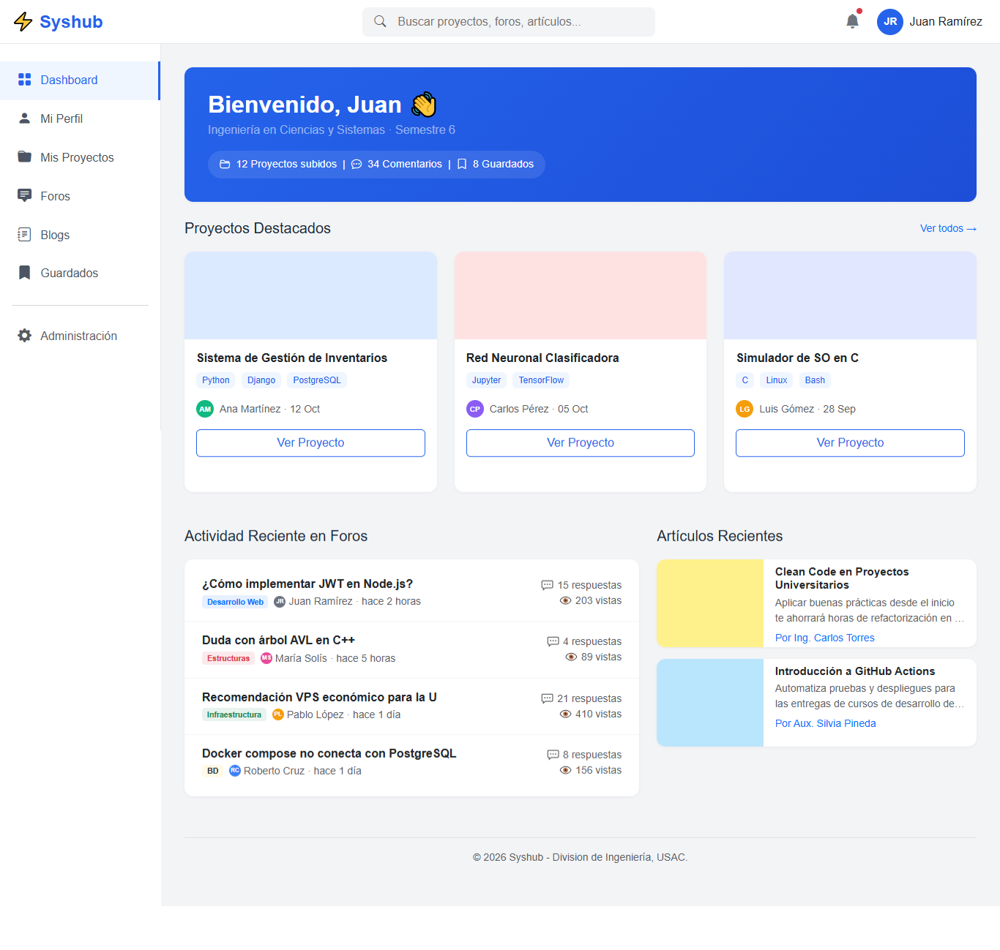
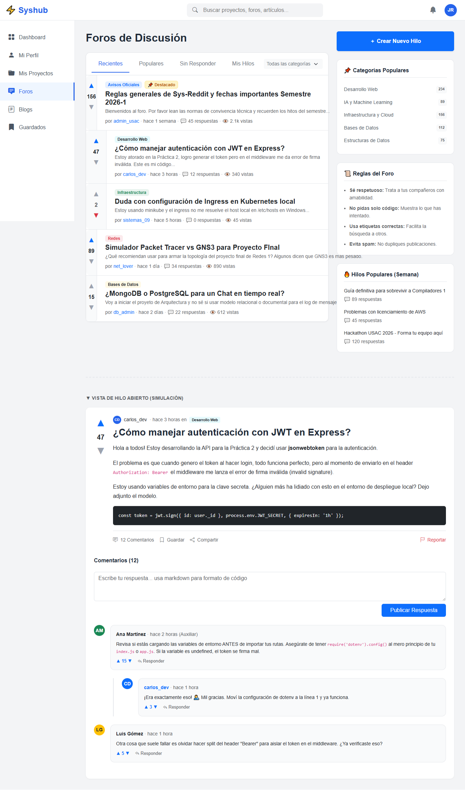
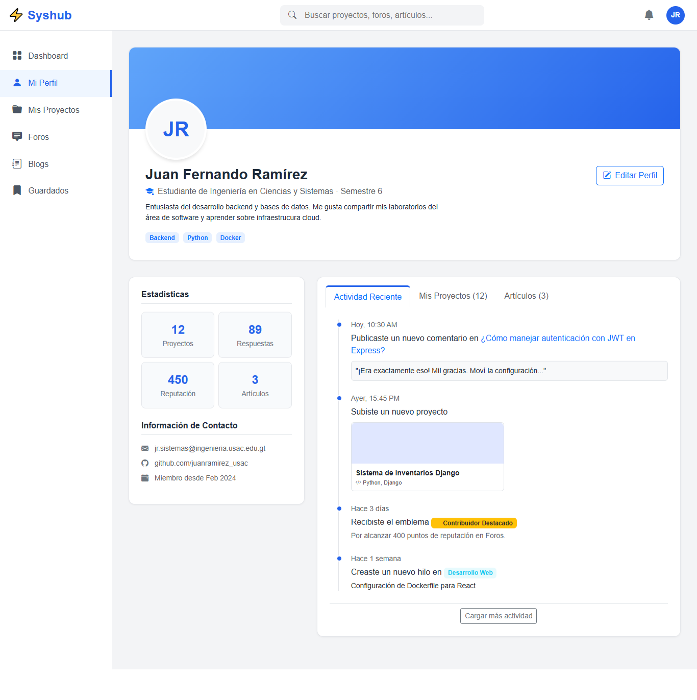
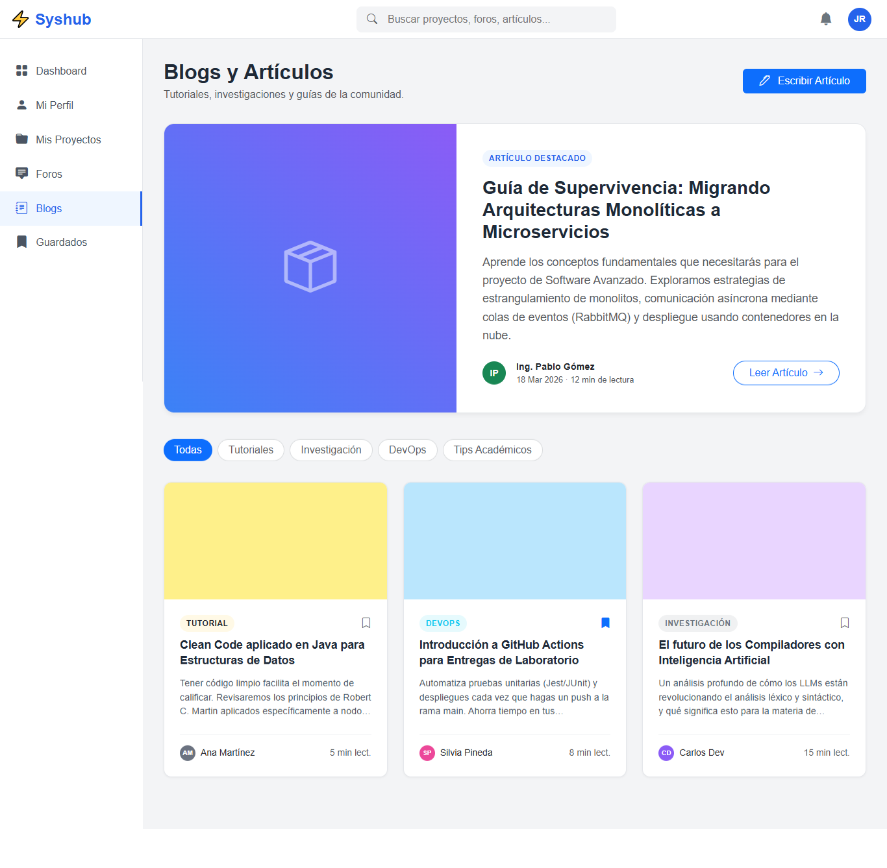
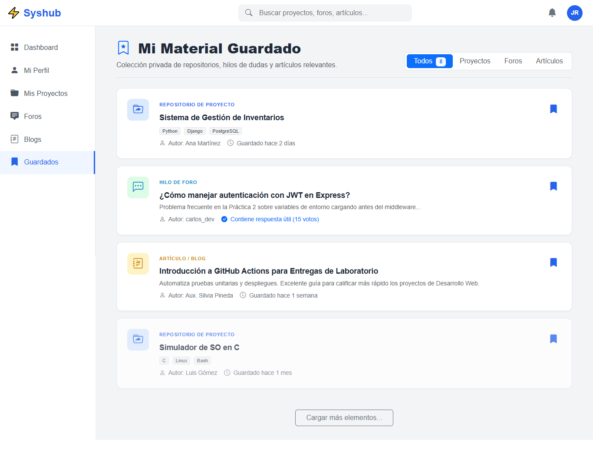

# Documentacion

# SECCIÓN 1 — GESTIÓN DE PROYECTO

## 1. ENUNCIADO DE ALCANCE DEL PROYECTO: SYSHUB

### 1.1. DESCRIPCIÓN GENERAL DEL PROYECTO

El presente documento establece las bases fundamentales, fronteras operativas y requerimientos técnicos para el diseño y construcción de **Syshub**. En términos sistémicos, Syshub se concibe como un ecosistema digital de aprendizaje continuo, orientado a la comunidad estudiantil y docente de la carrera de Ingeniería en Ciencias y Sistemas. 

La **naturaleza** del sistema radica en operar como una plataforma web integral enfocada estrictamente en la gestión, preservación y distribución del conocimiento académico. El **problema central que resuelve** es la pérdida sistemática de información y experiencia académica debida a la transición semestral; un fenómeno en el cual los hallazgos valiosos, las resoluciones estructurales de proyectos y el aprendizaje práctico de los estudiantes desaparecen una vez concluye un ciclo académico. Syshub propone transformar este "montón" de archivos desconectados en un sistema donde el conocimiento colectivo surge como una propiedad emergente de la interacción humana.

El **público objetivo** primario de esta solución tecnológica incluye a los estudiantes activos —que actúan como productores y consumidores simultáneos de conocimiento—, así como a los auxiliares de cátedra y docentes, quienes operan como curadores y validadores de la calidad de dicho contenido.

---

### 1. 2. DEFINICIÓN DE ALCANCE (IN SCOPE)

El sistema Syshub abarcará exclusivamente la fase operativa detallada a continuación, estructurándose mediante un enfoque modular que garantiza la cohesión y alta disponibilidad del ecosistema formativo. El alcance funcional se delimita a cuatro módulos cardinales entrelazados:

**A) Gestión de Identidad y Perfiles:** 
El sistema proveerá la infraestructura necesaria para la autenticación y autorización segura. Contempla el registro de usuarios, inicio de sesión seguro, encriptación de credenciales y flujos de recuperación de contraseñas. Cada individuo contará con un perfil académico persistente capaz de rastrear su actividad dentro del ciclo de vida del ecosistema, consolidando su propio material guardado, publicaciones propias e interacciones en foros.

**B) Repositorio de Proyectos y Tareas:** 
Constituye el núcleo de almacenamiento estructurado del sistema. Permitirá a los estudiantes realizar la carga categorizada de proyectos técnicos y académicos. Cada carga incluirá metadatos técnicos extensivos, como la descripción del planteamiento, el conjunto de tecnologías utilizado (stack tecnológico), archivos adjuntos validables y etiquetas paramétricas de búsqueda. Además, habilitará la "curaduría por auxiliares", un mecanismo para identificar y destacar el material sobresaliente, asegurando su disponibilidad para las futuras cohortes.

**C) Sección Social y Foros (Sys-Reddit):** 
Para asegurar la emergencia del conocimiento colectivo, se implementará un componente altamente interactivo basado en foros de discusión anidados, similar en arquitectura a Reddit. Habilitará la creación de hilos, un sistema de blogs para publicaciones de formato largo elaboradas por autores verificados, así como un robusto motor de interacciones con comentarios moderables y un sistema de valoraciones (upvotes/downvotes) enfocado en dar prominencia orgánica al mejor contenido técnico.

**D) Panel de Administración y Moderación:** 
Corresponde a la capa de gobernanza del ecosistema. Permitirá controles de Alto Nivel para la administración de usuarios, asignación y revocación de roles (Estudiante, Auxiliar, Administrador, Moderador) e instrumentará un esquema de clasificación jerárquica guiado por el pensum de estudios y áreas transversales de ingeniería. Proveerá integraciones para revisar casos de abuso, contenido reportado y aplicar sanciones.

---

### 1.3. FUERA DEL ALCANCE (OUT OF SCOPE)

Para garantizar la viabilidad técnica y adherencia al ciclo temporal de vida del proyecto establecido para la Fase 1, se declaran explícitamente fuera de los límites del sistema los siguientes elementos:

* **No incluye el desarrollo de aplicaciones móviles nativas** (Android / iOS). La entrega se restringirá estrictamente a una plataforma web responsiva.
* **No incluye sistemas de videoconferencia o streaming** en tiempo real integrados dentro de la plataforma.
* **No incluye integraciones directas con sistemas externos institucionales**, tales como portales de control académico o repositorios de asignación de notas oficiales de la facultad.
* **No se implementará ninguna pasarela de pagos**, monetización, ni cobros por acceso a la documentación académica o foros.
* **No incluye chat en vivo ni un sistema de mensajería privada directa (Direct Messages)** entre usuarios, con el fin de enfocar la comunicación al debate público en foros.
* **No aplica algoritmos de Inteligencia Artificial** para la recomendación de proyectos, ni matching de contenidos predictivos automatizados (esto se reserva para iteraciones futuras).

---

### 1.4. REQUISITOS FUNCIONALES Y 5. CRITERIOS DE ACEPTACIÓN

A continuación, se formalizan las especificaciones del sistema utilizando un diseño de matriz que interconecta los Requisitos Funcionales y sus correspondientes Criterios de Aceptación por módulo.

#### MÓDULO A: Gestión de Identidad y Perfiles

| ID           | Descripción Funcional                                                                                     | Actor                | Prioridad | Criterios de Aceptación (DADO / CUANDO / ENTONCES)                                                                                                                                                                                                                                                                                                  |
|:------------ |:--------------------------------------------------------------------------------------------------------- |:-------------------- |:--------- |:--------------------------------------------------------------------------------------------------------------------------------------------------------------------------------------------------------------------------------------------------------------------------------------------------------------------------------------------------- |
| **RF-A-001** | El sistema debe permitir el registro de nuevos usuarios verificando unicidad de correo institucional.     | Estudiante           | Alta      | **DADO** un usuario anónimo en la página de registro **CUANDO** ingresa un correo ya existente **ENTONCES** el sistema muestra un mensaje de "Correo ya registrado" y bloquea el envío.  **DADO** datos válidos y correo único **CUANDO** envía el formulario **ENTONCES** se crea la cuenta en estado inactivo hasta validación. |
| **RF-A-002** | El sistema debe posibilitar el inicio libre de sesión con credenciales válidas generadas.                 | Estudiante, Auxiliar | Alta      | **DADO** un usuario con cuenta activa **CUANDO** ingresa credenciales correctas **ENTONCES** se genera un token de sesión y se redirige al dashboard.  **DADO** un usuario en el login **CUANDO** ingresa una contraseña incorrecta 3 veces **ENTONCES** se bloquea temporalmente el inicio de sesión.                            |
| **RF-A-003** | El sistema debe facilitar el flujo seguro de recuperación de contraseña olvidada.                         | Estudiante           | Media     | **DADO** un usuario que olvidó su acceso **CUANDO** solicita restablecimiento por correo **ENTONCES** el sistema envía un enlace de un solo uso con expiración.  **DADO** que hizo clic en el enlace válido **CUANDO** asigna nueva contraseña **ENTONCES** la clave se actualiza y redirige al inicio.                           |
| **RF-A-004** | El sistema debe mostrar un perfil personal estructurado con el historial de actividad propio del usuario. | Estudiante           | Media     | **DADO** un usuario logueado adecuadamente **CUANDO** accede a la sección "Mi Perfil" **ENTONCES** se visualiza su información básica (carnet, semestre).  **DADO** el acceso a la vista de perfil **CUANDO** navega por la ventana **ENTONCES** observa la lista de hilos creados y proyectos subidos.                           |
| **RF-A-005** | El sistema debe permitir guardar en "favoritos" contenido externo y catalogarlo.                          | Estudiante           | Baja      | **DADO** un usuario viendo un proyecto de otro estudiante **CUANDO** hace clic en "Guardar Material" **ENTONCES** el registro se asocia a su perfil personal.  **DADO** que visita la zona "Mi Material" **CUANDO** selecciona revisar sus marcadores **ENTONCES** se listan todos los materiales que marcó.                      |

#### MÓDULO B: Repositorio de Proyectos y Tareas

| ID           | Descripción Funcional                                                                           | Actor      | Prioridad | Criterios de Aceptación (DADO / CUANDO / ENTONCES)                                                                                                                                                                                                                                                                                                   |
|:------------ |:----------------------------------------------------------------------------------------------- |:---------- |:--------- |:---------------------------------------------------------------------------------------------------------------------------------------------------------------------------------------------------------------------------------------------------------------------------------------------------------------------------------------------------- |
| **RF-B-001** | El sistema debe habilitar un formulario estructurado para la publicación de proyectos técnicos. | Estudiante | Alta      | **DADO** un estudiante en la pantalla de carga **CUANDO** llena título, descripción técnica y stack tecnológico **ENTONCES** se procesa la información en base a metadatos.  **DADO** el mismo estudiante **CUANDO** deja la descripción vacía y pulsa enviar **ENTONCES** surge una alerta indicando que es campo obligatorio.    |
| **RF-B-002** | El sistema debe permitir el anexo de archivos cumpliendo restricciones de formato y peso.       | Estudiante | Alta      | **DADO** el módulo de adjuntos en un proyecto **CUANDO** el usuario sube un archivo > 50MB **ENTONCES** se rechaza la carga informando límite de tamaño.  **DADO** el módulo de adjuntos **CUANDO** anexa archivos formatos .ZIP o .PDF permitidos **ENTONCES** los asocia a la base de datos del proyecto.                        |
| **RF-B-003** | El sistema debe admitir indexación del conocimiento usando etiquetas o "tags" temáticos.        | Estudiante | Media     | **DADO** el proceso de creación de proyecto **CUANDO** digita palabras clave como "Java" o "Grafos" **ENTONCES** las etiquetas se guardan relacionadas al proyecto.  **DADO** un usuario en el explorador global **CUANDO** filtra mediante la etiqueta "Grafos" **ENTONCES** ve todos los proyectos con ese tag específico.       |
| **RF-B-004** | El sistema debe proporcionar la interfaz de curaduría para marcar material destacado semestral. | Auxiliar   | Alta      | **DADO** un auxiliar visualizando el proyecto de un alumno **CUANDO** presiona el control de "Destacar Semestre" **ENTONCES** el proyecto obtiene la bandera de Curaduría Destacada.  **DADO** que destacó el proyecto **CUANDO** se lista en búsquedas posteriores **ENTONCES** aparece visualmente priorizado para todos.        |
| **RF-B-005** | El sistema debe registrar métricas de visibilidad simples por cada material subido.             | Sistema    | Baja      | **DADO** un proyecto público abierto en pantalla **CUANDO** es visitado por un usuario logueado único **ENTONCES** el contador de visualizaciones incrementa en 1.  **DADO** el autor observando su propio repositorio **CUANDO** revisa las tarjetas publicadas **ENTONCES** puede evaluar cuántas vistas ha recibido el recurso. |

#### MÓDULO C: Sección Social y Foros (Sys-Reddit)

| ID           | Descripción Funcional                                                                             | Actor                | Prioridad | Criterios de Aceptación (DADO / CUANDO / ENTONCES)                                                                                                                                                                                                                                                                                                                 |
|:------------ |:------------------------------------------------------------------------------------------------- |:-------------------- |:--------- |:------------------------------------------------------------------------------------------------------------------------------------------------------------------------------------------------------------------------------------------------------------------------------------------------------------------------------------------------------------------ |
| **RF-C-001** | El sistema debe habilitar el inicio de hilos de discusión categorizados técnicamente.             | Estudiante           | Alta      | **DADO** un estudiante que desea solventar una duda **CUANDO** selecciona "Crear Hilo" y elige la categoría "Bases de Datos" **ENTONCES** el hilo se crea clasificado correctamente.  **DADO** el hilo recién configurado **CUANDO** se navega a la categoría "Bases de Datos" **ENTONCES** aparece disponible en la lista de debates recientes. |
| **RF-C-002** | El sistema debe facilitar respuestas anidadas sobre hilos existentes y blogs.                     | Estudiante, Auxiliar | Alta      | **DADO** un hilo o publicación expuesta **CUANDO** un usuario presiona "Responder" y escribe contenido **ENTONCES** el comentario se adjunta secuencialmente al hilo.  **DADO** un comentario ya trazado **CUANDO** alguien responde a ese preciso comentario **ENTONCES** la respuesta se anida visualmente con sangría.                        |
| **RF-C-003** | El sistema debe calcular y mostrar el prestigio organizando contenido por valoraciones orgánicas. | Estudiante           | Alta      | **DADO** un comentario útil **CUANDO** cinco estudiantes otorgan un "Upvote" **ENTONCES** la calificación global del comentario es +5.  **DADO** un listado masivo de comentarios en un foro **CUANDO** es cargado en la web **ENTONCES** se ordenan descendentemente según su puntuación.                                                       |
| **RF-C-004** | El sistema debe posibilitar un entorno para artículos y guías profundas tipo "Blog".              | Auxiliar             | Media     | **DADO** un usuario con permisos de escritura avanzada **CUANDO** despliega la redacción de artículo en formato rico **ENTONCES** puede incorporar jerarquía, código e imágenes.  **DADO** el artículo expuesto **CUANDO** se publica **ENTONCES** aparece en una sección separada del foro normal.                                              |
| **RF-C-005** | El sistema debe proveer una vía para reportar contenido no apropiado.                             | Estudiante           | Baja      | **DADO** un comportamiento hostil en un foro **CUANDO** un usuario selecciona "Reportar Infracción" **ENTONCES** el contenido exige una razón predefinida.  **DADO** un reporte enviado con justificación **CUANDO** se consolida en la base **ENTONCES** levanta una bandera en el panel de revisión del moderador.                             |

#### MÓDULO D: Panel de Administración y Moderación

| ID           | Descripción Funcional                                                                   | Actor            | Prioridad | Criterios de Aceptación (DADO / CUANDO / ENTONCES)                                                                                                                                                                                                                                                                                                                                             |
|:------------ |:--------------------------------------------------------------------------------------- |:---------------- |:--------- |:---------------------------------------------------------------------------------------------------------------------------------------------------------------------------------------------------------------------------------------------------------------------------------------------------------------------------------------------------------------------------------------------- |
| **RF-D-001** | El sistema debe facilitar la visualización, alteración y supresión de cuentas (CRUD).   | Administrador    | Alta      | **DADO** un administrador operando el panel **CUANDO** busca por carnet a un individuo **ENTONCES** localiza todos los metadatos ligados al sujeto.  **DADO** el perfil del individuo identificado **CUANDO** remueve un rol o cuenta **ENTONCES** la cuenta pierde totalmente acceso al instante.                                                                           |
| **RF-D-002** | El sistema debe instrumentar la gestión global de roles y acreditaciones jerárquicas.   | Administrador    | Alta      | **DADO** la cuenta básica de un estudiante logueada **CUANDO** el gerente le asigna el rol de "Auxiliar" **ENTONCES** el sistema le otorga acceso a curaduría de proyectos.  **DADO** un auxiliar con período culminado **CUANDO** el administrador quita el rol **ENTONCES** revierte sus habilidades a nivel básico.                                                       |
| **RF-D-003** | El sistema debe gobernar la parametrización de pensum y asignaturas en tablas maestras. | Administrador    | Media     | **DADO** un cambio reciente implementado en la facultad **CUANDO** el administrador inserta el nuevo curso "Inteligencia Artificial 2" **ENTONCES** el curso aparece para todos al momento de etiquetar.  **DADO** un curso obsoleto **CUANDO** se procede a su archivado sistémico **ENTONCES** ya no se admite subida de material nuevo bajo el mismo.                     |
| **RF-D-004** | El sistema debe contar con una bandeja procesadora de reclamos sociales (Moderación).   | Moderador        | Alta      | **DADO** el acceso al panel central por un Moderador **CUANDO** verifica la cola de moderación pendiente **ENTONCES** ve la acumulación cronológica de conflictos reportados.  **DADO** un hilo denunciado múltiples veces **CUANDO** el Moderador presiona "Eliminar contenido" **ENTONCES** desaparece definitivamente de la vista pública.                                |
| **RF-D-005** | El sistema debe autorizar bloqueos y suspensiones por vulnerar regulaciones.            | Moderador, Admin | Media     | **DADO** un estudiante que trasgredió los términos severamente **CUANDO** el moderador dicta un "Baneo de cuenta" **ENTONCES** se revoca inmediatamente cualquier token activo del usuario.  **DADO** el mismo usuario baneado **CUANDO** intenta entrar nuevamente con sus credenciales intactas **ENTONCES** el sistema alerta "Acceso denegado: contacto con el soporte". |

-----

## 2 ESTRUCTURA DE DESGLOSE DE TRABAJO (EDT)

----

## 3. CRONOGRAMA DE ACTIVIDADES (DIAGRAMA DE GANTT)

Cronograma:

### 3.1 Tabla de Hitos de Control

| #   | Hito                                  | Semana   | Entregable verificable                                                                                                |
| --- | ------------------------------------- | -------- | --------------------------------------------------------------------------------------------------------------------- |
| 1   | Entorno y Auth base listos            | Semana 1 | Repositorio configurado, BD en la nube conectada y API funcional retornando token de registro/login exitoso.          |
| 2   | Módulo de Perfiles y Repositorio base | Semana 2 | Estudiante puede loguearse y subir un proyecto técnico (PDF/ZIP) funcional al sistema.                                |
| 3   | Ecosistema principal operativo        | Semana 3 | La curaduría funcional y creación exitosa de un primer hilo en foros con respuestas anidadas.                         |
| 4   | Plataforma social y Admin finalizado  | Semana 4 | Panel de moderación bloquea / activa roles; el sistema de upvotes funciona en tiempo real.                            |
| 5   | Sistema integrado y Desplegado        | Semana 5 | El proyecto está montado en un servidor público (URL activa) pasando las pruebas críticas libres de bugs graves (P0). |

### 3.2 Tabla de Tiempo Estimado por Módulo

| Módulo           | Actividad (Backend + Frontend en paralelo)          | Semanas       | Horas estimadas |
| ---------------- | --------------------------------------------------- | ------------- | --------------- |
| **Arquitectura** | Definición técnica, creación del repo y CI/CD       | 0.5 semanas   | 20 horas        |
| **Módulo A**     | Autenticación, Gestión de Perfiles y Sesiones       | 1.5 semanas   | 45 horas        |
| **Módulo B**     | Repositorio de Proyectos y vistas de Curaduría      | 1.5 semanas   | 50 horas        |
| **Módulo C**     | Foros de discusión (Sys-Reddit), Posts y Votos      | 2 semanas     | 60 horas        |
| **Módulo D**     | Panel de Gobernanza Administrativa y Moderador      | 1 semana      | 35 horas        |
| **Integración**  | QA testing integral, mitigación de errores y Deploy | 1 semana      | 40 horas        |
| **TOTAL**        | **Desarrollo completo acelerado**                   | **5 Semanas** | **250 horas**   |

---

---

# SECCIÓN 2 — MODELADO SISTÉMICO Y TÉCNICO

## 4. ANÁLISIS DSRP DEL SISTEMA SYSHUB

### 4.1. INTRODUCCIÓN

El framework DSRP (Distinctions, Systems, Relationships, Perspectives), desarrollado por los científicos Cabrera y Cabrera (2006), es un modelo avanzado de pensamiento sistémico diseñado para comprender la complejidad mediante la deconstrucción estructural de un fenómeno. Al aplicar el DSRP al proyecto "Syshub", el objetivo no es meramente enumerar los componentes de software, sino decodificar los patrones subyacentes que permiten a una simple plataforma web evolucionar hasta convertirse en un ecosistema de aprendizaje continuo. Este marco analítico permite estructurar mentalmente Syshub, definiendo sus límites axiomáticos, evaluando cómo sus partes individuales generan un todo emergente, mapeando las sinergias entre los usuarios y el contenido, y reconociendo cómo la percepción del entorno cambia drásticamente según quién interactúe con él.

### 4.2. D — DISTINCIONES (QUÉ ES Y QUÉ NO ES)

La dimensión de las distinciones define las fronteras ontológicas de Syshub; es decir, traza una línea clara entre lo que el sistema debe hacer y aquello de lo que debe abstenerse para mantener su propósito original inalterado.
En primer lugar, establecemos que Syshub **ES** un ecosistema digital enfocado puramente en el conocimiento colectivo. A nivel operativo, actúa como un repositorio académico vivo que evoluciona con cada ciclo semestral. No es un cementerio de código obsoleto u olvidado, sino una red social técnica altamente especializada. La plataforma es un moderador orgánico de la experiencia estudiantil en la Facultad de Ingeniería en Ciencias y Sistemas: un hub donde el prestigio se gana por la calidad de las soluciones aportadas.

Por contraste, es crucial delimitar lo que Syshub **NO ES**, previniendo que el "scope creep" (corrupción del alcance), debilite su arquitectura. Syshub no es un Sistema de Gestión de Aprendizaje (LMS) institucional como Canvas, Moodle o UEDi, por ende, carece de mecanismos formales para entregar notas, tomar asistencias o publicar ponderaciones oficiales de los catedráticos. Tampoco cumple las funciones cognitivas de una red social de carácter general (como Facebook o Instagram); sus foros están restringidos a la esfera académico-profesional. Finalmente, está distanciado de las plataformas de comunicación síncrona; en consecuencia, no integra esquemas para videoconferencias o mensajería en tiempo real tipo chat directo. Se mantiene focalizado estrictamente en la acumulación y categorización asíncrona pero altamente estructurada de saberes.

### 4.3. S — SISTEMAS (PARTES Y EL TODO)

En el modelo DSRP, un "sistema" se comprende determinando que cualquier entidad grande es la sumatoria interdependiente de sistemas menores subordinados (partes) que exhiben funciones limitadas por separado, pero un nivel de complejidad superior al reunirse. En el caso de Syshub, su anatomía está segmentada estructuralmente en cuatro subsistemas técnicos que se correlacionan. Se identifica un *Subsistema de Identidad*, responsable de la individualización y seguridad criptográfica de las credenciales; un *Subsistema de Conocimiento*, el núcleo duro de almacenamiento, que acopia proyectos y maneja el versionado documental de curaduría; un *Subsistema Social*, que alberga los foros, la calificación comunitaria y blogs; y un *Subsistema de Gobernanza*, la capa administrativa que dicta normas, jerarquiza roles y censura el ruido entrópico.

Si analizamos estos cuatro módulos de forma aislada, encontramos sistemas puramente mecánicos: un registro CRUD, una base de almacenamiento de datos o un renderizador de listas. Sin embargo, cuando se operan en conjunto provocan un fenómeno conocido en teoría de sistemas como una **propiedad emergente**. En Syshub, esa propiedad es la *preservación transgeneracional del conocimiento colectivo*: un resultado sistémico que los módulos no pueden fabricar de modo individual. Gracias a la existencia combinada de perfiles, un foro donde consultarlo y curadores que destaquen lo adecuado, la base de datos trasciende y se percibe una inteligencia colectiva que neutraliza la amnesia semestral en la facultad cada vez que cambia un ciclo lectivo.

### 4.4. R — RELACIONES (INTERACCIONES)

Las relaciones dentro de Syshub componen la fuerza metabólica y dinámica del entorno, enlazando entidades que no poseen un significado contundente fuera de esta interdependencia. Un repositorio por sí mismo carece de vitalidad sin una interacción; por tanto, el eje es la de *Usuario-Contenido*. El estudiante que actúa de nodo productor (subir un proyecto o abrir un hilo en los foros) retroalimenta el sistema, al ser calificado, comentado o cuestionado por otro nodo receptor, lo que instiga un ciclo constante de generación intelectual mediada.

Se desprenden igualmente las relaciones asimétricas, como aquellas del *Auxiliar-Proyecto* y del *Administrador-Sistema*. El Auxiliar establece la relación de Curaduría: no se adueña de la producción ajena, sino que aplica una interacción de filtrado evaluativo (destacando material semestral valioso) para maximizar la calidad orientada en los foros. De manera análoga, la relación *Admin-Sistema* es rectora; el administrador clasifica e impone moderaciones para que las estructuras permanezcan alineadas al pensum real vigente. Asimismo, no debe ignorarse la interacción de nivel superior generada por una entidad inmaterial o no humana llamada *Contenido-Visibilidad*: un patrón de realimentación positiva algorítmica donde un proyecto altamente valorado ("Upvoting" de foros), recibe mayor atracción automática desde el propio sistema, posicionándose espontáneamente hacia la primera página sin intervención administrativa adicional.

### 4.5. P — PERSPECTIVAS

Cualquier sistema complejo se comporta y tiene lecturas distintas en función del punto de observación o el contexto local del sujeto que examina la estructura, una noción intrínseca a la dimensión "Perspectivas". Para un **Estudiante**, la plataforma adquiere el cariz de un centro colaborativo e inmediato. El usuario ordinario experimenta Syshub adoptando el rol de "Prosumidor" (productor + consumidor simultáneo). Visualiza una herramienta indispensable para resolver barreras técnicas urgentes del día a día (dudas recurrentes en compiladores, lenguajes, etc.) y como un portafolio primitivo para atesorar y mostrar a sus pares la gloria particular de un compilador entregado en óptimas condiciones.

Por su parte, la perspectiva del **Auxiliar de Cátedra** es diametralmente analítica e historicista. Ven el sistema como un mecanismo curatorial o como un registro documental semestral formal; un medio por el que las resoluciones robustas e inteligentes de los laboratorios no terminan perdiéndose ni borradas a los cuatro meses. La perspectiva del **Administrador**, bajo su perfil panóptico general, decodifica y evalúa la salud holística y legal del ecosistema (estabilidad estadística, categorías desfasadas). Y finalmente, en un plano altamente filosófico, la perspectiva **del Sistema en Sí Mismo** visualiza su propia arquitectura no como una plataforma rígida de registros con un servidor cloud, sino como un organismo de red emergente de conocimiento vivo, diseñado para auto-preservarse, mutar e incrementarse en inteligencia distribuida.

### 4.6. TABLA RESUMEN DSRP

| Dimensión        | Elemento Analizado         | Descripción Sistémica                                                                                                              | Impacto en el Sistema Syshub                                                                                                |
|:----------------:|:-------------------------- |:---------------------------------------------------------------------------------------------------------------------------------- |:--------------------------------------------------------------------------------------------------------------------------- |
| **Distinciones** | Repositorio VS LMS         | Syshub aloja proyectos técnicos colectivos asíncronos; de ningún modo estructura notas, asistencia o rubricas formales académicas. | Previene la burocratización de la plataforma y sobrecarga de uso por responsabilidades administrativas del profesorado.     |
| **Distinciones** | Red Social Especializada   | Limita la comunicación a hilos y publicación académica, prohibiendo mensajes directos privados (DMs) de socialización.             | Concentra la base de datos en información de alto grado de consulta útil para toda la comunidad simultáneamente.            |
| **Distinciones** | Esfera de Conocimiento     | Determina formalmente al sistema como un hábitat para la salvaguarda y retransmisión de saberes, opuesto a una red general.        | Fija los requerimientos de diseño a la priorización de código y teoría aplicativa como metadato primario del software.      |
| **Distinciones** | Inclusión y Exclusión      | Declara funcionalidades estrictamente Web, sin algoritmos automáticos IA de recomendación predictiva.                              | Garantiza la entrega técnica con viabilidad dentro de la restricción presupuestaria temporal de la actual "Fase 1".         |
| **Sistemas**     | Módulo de Identidad        | Subsistema estructurado por reglas criptográficas (Roles, Perfiles, Login JWT).                                                    | Proporciona individualidad a cada acción en el Ecosistema para que asimile reputación persistente.                          |
| **Sistemas**     | Módulo de Repositorio      | Centro persistente de acopio y descargas de código, recursos en JSON y etiquetado (TAGS).                                          | Actúa como nodo de información inerte en espera de reanimación y conexión con futuras dudas.                                |
| **Sistemas**     | Módulo Social Foros        | Intersecciones algorítmicas (Sys-Reddit) entre perfiles y conocimiento para entablar debatas escalares.                            | Estimula al software inerte de proyectos logrando que se transforme hacia el aprendizaje continuo mutante.                  |
| **Sistemas**     | Propiedad Emergente        | El conocimiento técnico imperecedero, consolidado como un activo derivado espontáneo inter-módulo.                                 | Causa la propia razón de existir de los modelos estructurales reduciendo sistemáticamente la amnesia en facultades.         |
| **Relaciones**   | Hilo y Respuesta           | Enlace recíproco y temporal dependiente en los Foros donde una Consulta incita una réplica.                                        | Dinamiza orgánicamente toda la base de datos atrayendo un tráfico constante participativo.                                  |
| **Relaciones**   | Curador y Laboratorio      | Relación jerárquica semi-automática en virtud de la cual un auxiliar promueve contenidos al rango superior destacado.              | Impide la saturación de data inservible orientando algoritmos para visibilizar lo genuinamente sobresaliente.               |
| **Relaciones**   | Administrador y Estructura | Flujos bidireccionales en los cuales se controlan penalizaciones y reestructuraciones de áreas en el árbol.                        | Consigue prevenir estancamientos del proyecto frente a reformas programáticas del nivel administrativo universitario.       |
| **Relaciones**   | Valoración Reputacional    | Algoritmo derivado del feedback "Upvote/Downvote" provocando que una publicación obtenga visualizaciones multiplicativas.          | Fomenta gamificación en donde la exactitud del conocimiento aportado dictamina directamente un estatus privilegiado social. |
| **Perspectivas** | Visión del Estudiante      | Uso pragmático: resolver dudas, hallar ayuda en laboratorios y exhibición de aportaciones al portafolio.                           | Alimenta operativamente e impulsa permanentemente al sistema y lo masifica como sus generadores originarios.                |
| **Perspectivas** | Visión del Auxiliar        | Uso documentalista: registro empírico y plataforma de re-difusión eficiente o preservación material del talento docente            | Sirve de herramienta catalizadora con respecto a los contenidos sobresalientes o a proyectos impecables.                    |
| **Perspectivas** | Visión del Moderador       | Uso correctivo: radar permanente de anomalías, spam o contenido de carácter impropio en los servidores.                            | Mantiene purificado, operativo y estático el orden institucional permitiendo que el sistema conserve reputación impecable.  |
| **Perspectivas** | Visión Orgánica Global     | Redes autosanadoras donde un flujo sinérgico masivo se integra previniendo a la desaparición semestral sistemática.                | Comprende al ecosistema global holístico capaz de producir memoria institucional continua emergente.                        |

---

## 5. MAPA DE PROCESOS

### 5.1. Flujo de Registro e Inicio de Sesión de Usuario

### 5.2. Flujo de Publicación de un Repositorio de Proyecto

### 5.3. Flujo de Participación en Foro (Sys-Reddit)

## 6. DIAGRAMA ENTIDAD-RELACIÓN / LÓGICO (DER)

-----

## 7. MOCKUPS

### 7.1. Dashboard

### 7.2. Foros

### 7.3. Repositorio (Mis Proyectos)

### 7.4. Perfil

### 7.5. Blogs y artículos

### 7.6. Guardados

