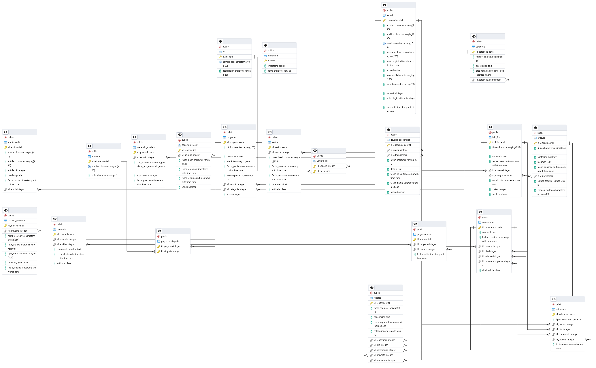

# Manual Técnico: Syshub

Este documento constituye el **Manual Técnico** de **Syshub**, un ecosistema digital de aprendizaje continuo diseñado para evitar la pérdida sistemática de información académica y fomentar la emergencia de conocimiento mediante la interacción social. 

Este manual está dirigido a desarrolladores, arquitectos de software y administradores de bases de datos que requieran comprender la estructura, integración y operación del sistema.

---

## 1. Arquitectura del Sistema

Syshub está construido sobre una arquitectura cliente-servidor basada en componentes modernos y un enfoque API RESTful. La arquitectura lógica asegura alta disponibilidad, separación de responsabilidades (SoC) y persistencia segura.

### Stack Tecnológico
* **Frontend (Cliente):** Vue.js (v3) utilizando Composition API para el manejo del ciclo de vida y la reactividad.
* **Estilos:** Tailwind CSS para un diseño responsivo y un sistema de diseño consistente.
* **Backend (Servidor):** NestJS (Framework de Node.js) que proporciona una estructura modular, inyección de dependencias y decoradores avanzados.
* **Base de Datos:** PostgreSQL (Relacional) para garantizar integridad referencial y soporte transaccional robusto.

### Estructura Lógica de Integración
1.  **Capa de Presentación (Frontend):** Las vistas en Vue.js interactúan con el usuario. Las peticiones asíncronas (Axios/Fetch) se comunican con el backend mediante la URL base `http://localhost:3000/api`.
2.  **Capa de Autenticación y Seguridad:** El backend implementa JWT (JSON Web Tokens). Las rutas protegidas requieren el encabezado `Authorization: Bearer <token>`.
3.  **Capa de Controladores (Backend):** NestJS expone los endpoints, maneja la validación de entrada (DTOs) y orquesta la lógica mediante Servicios.
4.  **Capa de Persistencia (Base de Datos):** El ORM (TypeORM/Prisma) traduce las operaciones lógicas a consultas en PostgreSQL, manteniendo el esquema y las validaciones de tipo en sincronía.

---

## 2. Documentación de la API

La API REST de Syshub expone sus recursos a través de los siguientes módulos principales. Todas las respuestas de error siguen el estándar de NestJS (`statusCode`, `message`, `error`) y las listas incluyen paginación (`items`, `total`, `page`, `limit`).

### Módulo A: Gestión de Identidad (`/api/auth`)
Encargado de la seguridad y sesión del usuario.

* `POST /api/auth/register`: Registra un nuevo usuario (requiere unicidad de email).
* `POST /api/auth/login`: Autentica al usuario devolviendo un JWT y los datos del perfil (Roles).
* `GET /api/auth/me`: Retorna el perfil estructurado del usuario autenticado (requiere JWT).
* `PATCH /api/auth/me`: Actualiza la información del perfil del usuario (foto, semestre, etc.).

### Módulo B: Proyectos y Tareas (`/api/projects`)
Gestión del repositorio de hallazgos técnicos.

* `POST /api/projects`: Crea un nuevo proyecto (título, descripción técnica, stack).
* `GET /api/projects`: Lista los proyectos (soporta paginación y filtros).
* `GET /api/projects/me/list`: Lista los proyectos cargados por el usuario activo.
* `PATCH /api/projects/<ID>`: Modifica un proyecto (ej. cambiar estado).
* `POST /api/projects/<ID>/files/upload`: Sube un archivo adjunto al proyecto (`multipart/form-data`, formatos `.pdf`, `.zip`, máx 50MB).
* `POST /api/projects/<ID>/curate`: Herramienta de curaduría para Auxiliares/Admins para destacar proyectos en el semestre.
* `GET /api/projects/search`: Motor de búsqueda mediante *query params* (`tag`, `categoryId`, `q`).

### Módulo C: Social y Foros (`/api/social`)
Fomenta el conocimiento como propiedad emergente ("Sys-Reddit").

* `POST /api/social/threads`: Crea un hilo de discusión categorizado.
* `POST /api/social/threads/<ID>/comments`: Agrega una respuesta/comentario anidado a un hilo.
* `POST /api/social/articles`: Crea un artículo tipo blog (exclusivo para Auxiliar/Admin).
* `POST /api/social/votes`: Emite una valoración (`upvote` o `downvote`) a un comentario.
* `POST /api/social/reports`: Permite a los usuarios reportar contenido no apropiado.

### Módulo D: Panel de Administración y Moderación (`/api/admin`)
Capa de gobernanza del ecosistema.

* `GET /api/admin/users`: Visualización jerárquica de usuarios.
* `POST /api/admin/users/<ID>/roles`: Asigna credenciales jerárquicas (ej. promover a AUXILIAR o MODERADOR).
* `POST /api/admin/users/<ID>/suspensions`: Autoriza bloqueos/baneos por trasgresiones.
* `POST /api/admin/categories`: Parametriza nuevas categorías del pensum (ej. Inteligencia Artificial, Redes).
* `PATCH /api/admin/moderation/reports/<ID>/status`: Atiende y resuelve la cola de moderación.
* `DELETE /api/admin/moderation/threads/<ID>`: Elimina forzosamente un hilo que incumple normativas.

---

### 3. Diagrama de Base de Datos Final (DER)

-----
### 4. Diccionario de Datos

#### 4.1. Tipos de Datos Definidos (ENUMS)

El sistema utiliza enumeraciones nativas de PostgreSQL para garantizar la integridad del dominio de datos:

- `estado_proyecto`: 'borrador', 'pendiente', 'publicado', 'archivado'
    
- `estado_hilo`: 'abierto', 'cerrado', 'archivado'
    
- `estado_articulo`: 'borrador', 'publicado', 'archivado'
    
- `estado_reporte`: 'pendiente', 'resuelto', 'desestimado'
    
- `tipo_valoracion`: 'upvote', 'downvote'
    
- `area_tecnica_cat`: 'Metodologia_Sistemas', 'Desarrollo_Software', 'Ciencias_Computacion', 'Otro'
    
- `tipo_contenido_guardado`: 'proyecto', 'articulo', 'hilo'
    

#### 4.2. Módulo A: Identidad y Seguridad

**Tabla: `USUARIO`**

|**Campo**|**Tipo**|**Restricciones**|**Descripción**|
|---|---|---|---|
|`id_usuario`|INT|PK, IDENTITY|Identificador único del usuario.|
|`nombre`|VARCHAR(100)|NOT NULL|Nombre del usuario.|
|`apellido`|VARCHAR(100)|NOT NULL|Apellido del usuario.|
|`email`|VARCHAR(150)|NOT NULL, UNIQUE|Correo institucional. Posee índice de optimización.|
|`password_hash`|VARCHAR(255)|NOT NULL|Hash encriptado de la contraseña.|
|`fecha_registro`|TIMESTAMPTZ|DEFAULT CURRENT|Fecha exacta de creación de la cuenta.|
|`activo`|BOOLEAN|DEFAULT TRUE|Control lógico de acceso.|
|`foto_perfil`|VARCHAR(255)||URL o ruta de la foto de perfil.|
|`carnet`|VARCHAR(20)||Carnet universitario del estudiante.|
|`semestre`|INT|CHECK (1-15)|Semestre actual en curso.|
|`failed_login_attempts`|INT|DEFAULT 0|Contador para bloqueos de seguridad.|
|`lock_until`|TIMESTAMPTZ||Marca temporal de bloqueo temporal.|

**Tabla: `SESION`**

|**Campo**|**Tipo**|**Restricciones**|**Descripción**|
|---|---|---|---|
|`id_sesion`|INT|PK, IDENTITY|Identificador de la sesión.|
|`id_usuario`|INT|FK, NOT NULL|Usuario dueño de la sesión. CASCADE Delete.|
|`token_hash`|VARCHAR(255)|NOT NULL|Hash del Refresh Token o JWT. Índice asignado.|
|`fecha_expiracion`|TIMESTAMPTZ|NOT NULL|Fecha de caducidad de la sesión.|
|`ip_address`|INET||Dirección IP de conexión.|

_(Tablas complementarias: `ROL`, `USUARIO_ROL`, `PASSWORD_RESET`)_

#### 4.3. Módulo B: Repositorio de Proyectos

**Tabla: `PROYECTO`**

|**Campo**|**Tipo**|**Restricciones**|**Descripción**|
|---|---|---|---|
|`id_proyecto`|INT|PK, IDENTITY|Identificador del proyecto.|
|`titulo`|VARCHAR(200)|NOT NULL|Título del aporte.|
|`descripcion`|TEXT||Detalle del problema y solución.|
|`stack_tecnologico`|JSONB||Array eficiente de herramientas usadas.|
|`estado`|estado_proyecto|DEFAULT 'borrador'|Estado de visibilidad actual. Índice asignado.|
|`id_usuario`|INT|FK, NOT NULL|Creador del proyecto.|
|`id_categoria`|INT|FK, SET NULL|Área técnica a la que pertenece.|
|`vistas`|INT|DEFAULT 0|Contador desnormalizado para consultas rápidas.|

**Tabla: `ARCHIVO_PROYECTO`**

|**Campo**|**Tipo**|**Restricciones**|**Descripción**|
|---|---|---|---|
|`id_archivo`|INT|PK, IDENTITY|ID único del archivo adjunto.|
|`id_proyecto`|INT|FK, NOT NULL|Proyecto contenedor. CASCADE Delete.|
|`nombre_archivo`|VARCHAR(255)|NOT NULL|Nombre original (ej. manual.pdf).|
|`ruta_archivo`|VARCHAR(500)|NOT NULL|Ruta en el sistema de almacenamiento.|
|`tipo_mime`|VARCHAR(100)||Application/pdf, zip, etc.|

_(Tablas complementarias: `ETIQUETA`, `PROYECTO_ETIQUETA`, `CURADURIA`, `PROYECTO_VISTA`)_

#### 4.4. Módulo C: Social y Foros (Sys-Reddit)

**Tabla: `HILO_FORO`**

|**Campo**|**Tipo**|**Restricciones**|**Descripción**|
|---|---|---|---|
|`id_hilo`|INT|PK, IDENTITY|ID del hilo de discusión.|
|`titulo`|VARCHAR(255)|NOT NULL|Título de la pregunta o debate.|
|`contenido`|TEXT|NOT NULL|Cuerpo de la discusión.|
|`id_usuario`|INT|FK, NOT NULL|Autor del hilo.|
|`id_categoria`|INT|FK, SET NULL|Curso/Categoría asociada. Índice asignado.|
|`estado`|estado_hilo|DEFAULT 'abierto'|Permite o bloquea nuevas respuestas.|

**Tabla: `COMENTARIO`**

|**Campo**|**Tipo**|**Restricciones**|**Descripción**|
|---|---|---|---|
|`id_comentario`|INT|PK, IDENTITY|ID del comentario o respuesta.|
|`contenido`|TEXT|NOT NULL|Cuerpo del texto.|
|`id_hilo`|INT|FK, CASCADE|Hilo padre (si aplica).|
|`id_articulo`|INT|FK, CASCADE|Artículo padre (si aplica).|
|`id_comentario_padre`|INT|FK, CASCADE|Para anidación tipo Reddit. Índice asignado.|
|_Constraint_|CHECK||Asegura que pertenezca a un hilo o artículo obligatoriamente.|

**Tabla: `VALORACION`**

|**Campo**|**Tipo**|**Restricciones**|**Descripción**|
|---|---|---|---|
|`tipo`|tipo_valoracion|NOT NULL|Puede ser 'upvote' o 'downvote'.|
|`id_usuario`|INT|FK, NOT NULL|Estudiante que votó.|
|`id_hilo / id_comentario / id_articulo`|INT|FK|Entidades destino de la valoración.|
|_Constraint_|CHECK||Garantiza que se asocie a una y solo a una entidad destino.|

#### 4.5. Módulo D: Moderación y Gobernanza

**Tabla: `REPORTE`**

|**Campo**|**Tipo**|**Restricciones**|**Descripción**|
|---|---|---|---|
|`id_reporte`|INT|PK, IDENTITY|ID del caso de denuncia.|
|`razon`|VARCHAR(255)|NOT NULL|Categoría de la falta (ej. spam, hostilidad).|
|`estado`|estado_reporte|DEFAULT 'pendiente'|Ciclo de vida del reporte.|
|`id_reportador`|INT|FK, SET NULL|Usuario que levanta la alerta.|
|`id_moderador`|INT|FK, SET NULL|Administrador que atiende y resuelve el caso.|

_(Tablas complementarias: `ADMIN_AUDIT`, `USUARIO_SUSPENSION`, `CATEGORIA`)_

