# 📘 Manual de Usuario - Syshub

Bienvenido a **Syshub**, el ecosistema centralizado para el intercambio de conocimientos técnicos, gestión de proyectos académicos y colaboración en foros para la Division de Ingeniería.

---

## 1. Inicio de Sesión y Perfil

### 1.1 Registro de Cuenta

Para unirte a la plataforma, debes completar el formulario de registro con tus datos académicos:

- **Nombre y Apellido**: Tu identidad real.

- **Correo Electrónico**: Será tu identificador de acceso.

- **Carnet y Semestre**: Datos esenciales para validar tu estatus académico.
  
  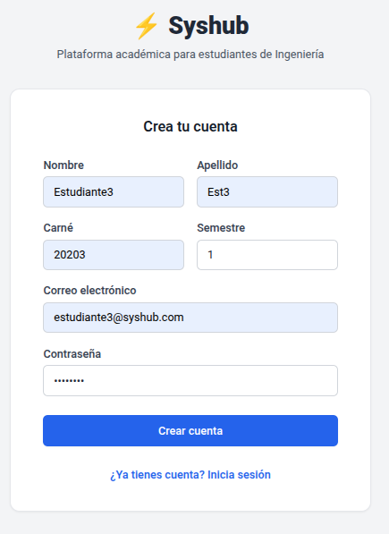

### 1.2 Inicio de Sesión

Una vez registrado, ingresa con tu correo y contraseña. El sistema te otorgará un token de acceso seguro para navegar por las funciones protegidas.

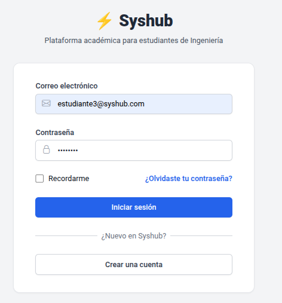

### **Recuperacion de contraseña**

Se le enviará a su correo un link para que pueda recuperar contraseña

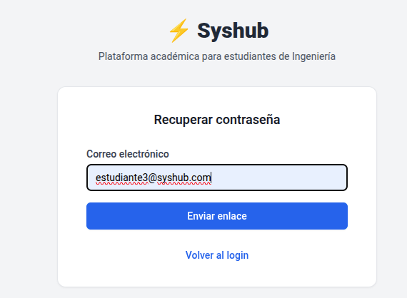

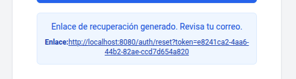

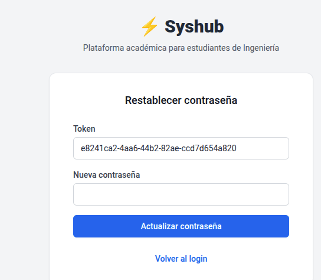

### 1.3 Gestión de Perfil

En la sección "Mi Perfil", puedes:

- Actualizar tu fotografía de perfil.

- Verificar tu semestre actual.

- Revisar los roles asignados (Estudiante, Auxiliar o Moderador).
  
  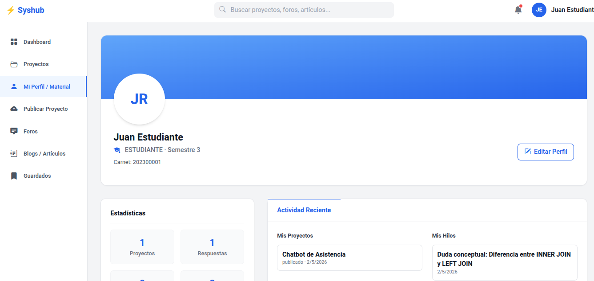

---

## 2. Módulo de Proyectos

### 2.1 Explorar Proyectos

En la pantalla principal, puedes buscar proyectos utilizando filtros por:

- **Etiquetas**: Lenguajes o herramientas específicas (ej. Java, Python).

- **Categorías**: Áreas técnicas como Desarrollo de Software o IA.

- **Buscador**: Palabras clave en el título o descripción.
  
  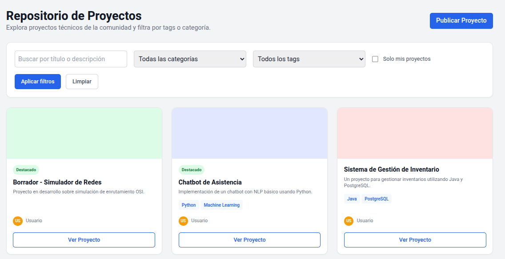

### 2.2 Publicar un Proyecto

Si deseas compartir un trabajo, sigue estos pasos:

1. **Información General**: Título, descripción y categorías.

2. **Stack Tecnológico**: Define las tecnologías utilizadas en formato JSON o lista.

3. **Estado**: Puedes guardarlo como "Borrador" antes de publicarlo oficialmente.
   
   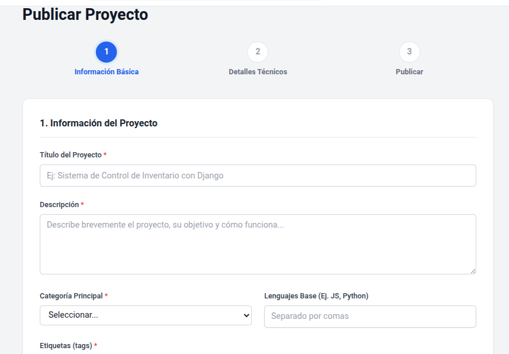

**El Auxiliar podra ver y descartar los proyectos que sean correspondidos (CURADURÍA)**

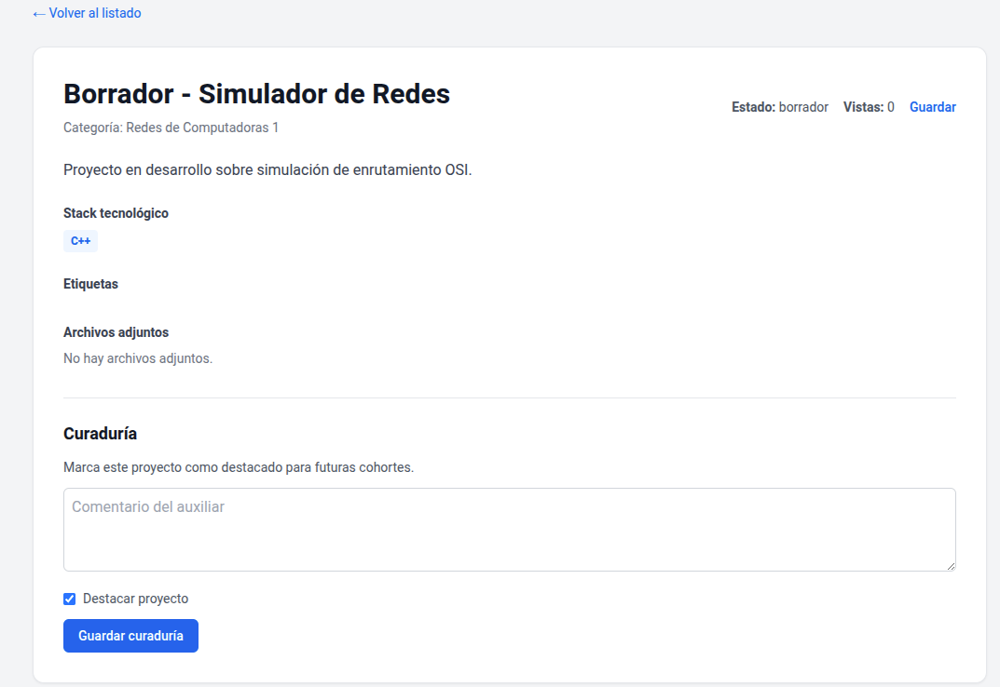

### 2.3 Gestión de Archivos

Puedes adjuntar documentación o código fuente a tus proyectos:

- **Formatos**: Se permiten archivos `.pdf` y `.zip`.

- **Límite**: El tamaño máximo por archivo es de 50MB.
  
  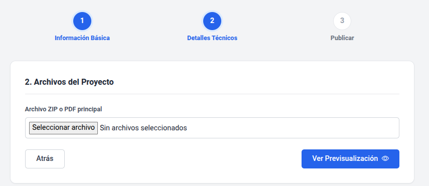

---

## 3. Módulo Social y Foros

### 3.1 Hilos de Discusión

¿Tienes una duda técnica? Crea un hilo en el foro:

- Selecciona la categoría adecuada (ej. Ciencias de la Computación).

- Describe tu problema detalladamente.

- Recibe respuestas de otros estudiantes o auxiliares.
  
  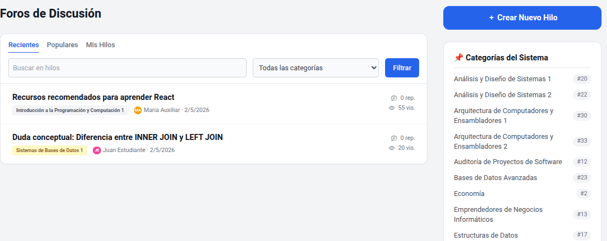

### 3.2 Artículos Técnicos

Los usuarios con rol de **Auxiliar** o **Admin** pueden publicar guías y tutoriales en formato HTML para la comunidad.

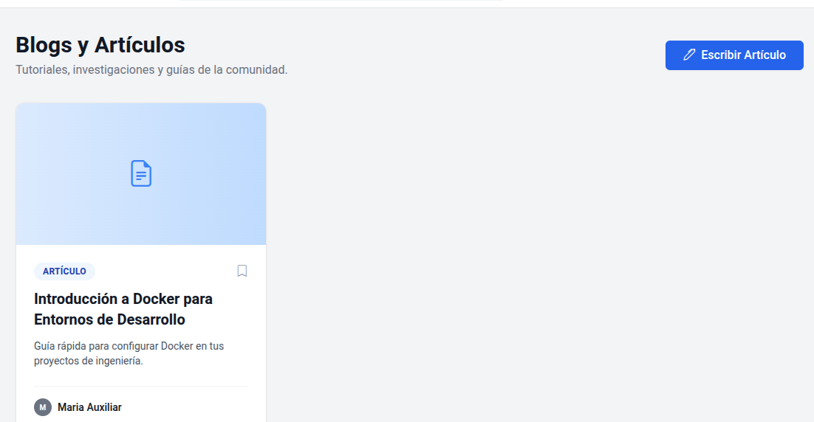

**El auxiliar podra escribir articlulos**

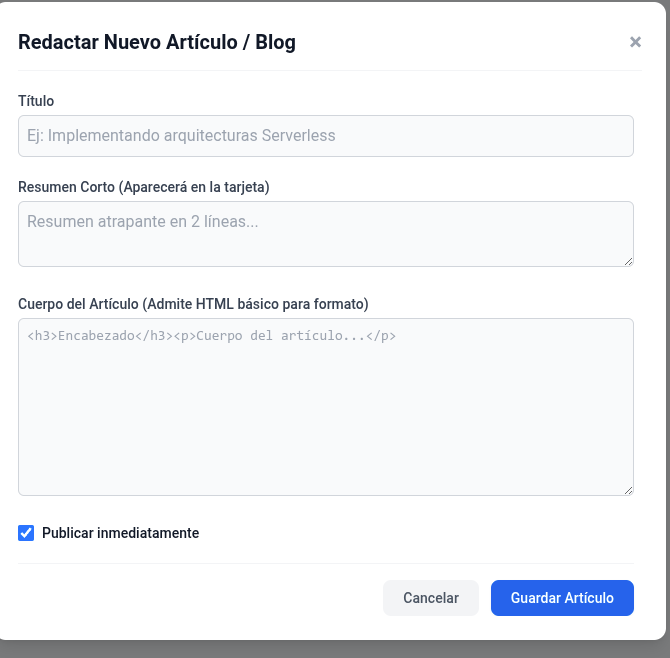

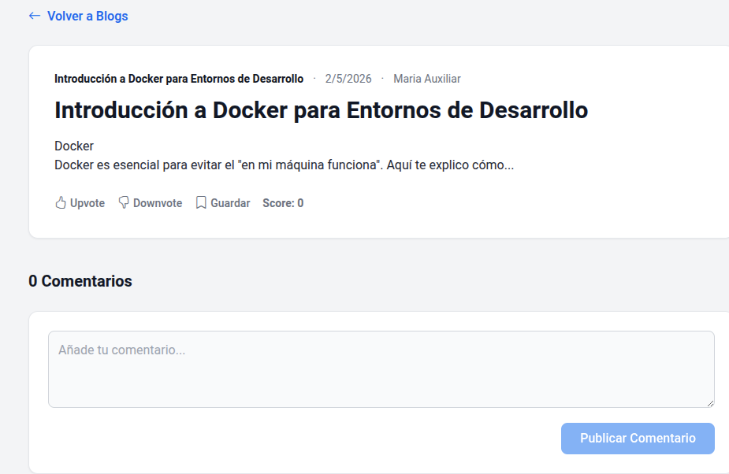

### 3.3 Valoraciones y Comentarios

Participa activamente en la comunidad:

- **Upvote/Downvote**: Califica la utilidad de un comentario o hilo.

- **Comentarios Anidados**: Responde directamente a otros usuarios para mantener el orden de la conversación.
  
  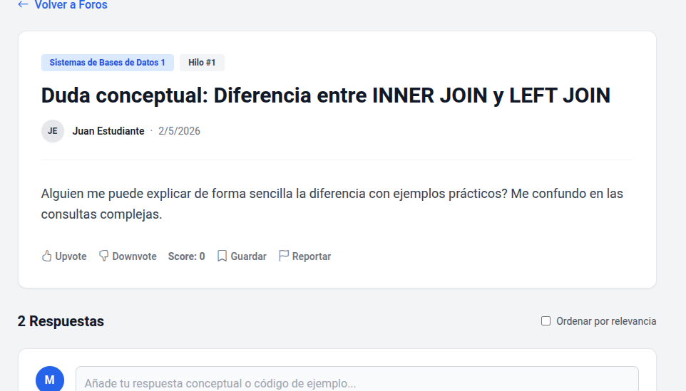

---

## 4. Moderación y Reportes

### 4.1 Reportar Contenido

Si encuentras contenido que incumple las normas (spam, lenguaje ofensivo), utiliza el botón de reporte:

- Debes indicar la razón del reporte.

- Un moderador revisará el caso y podrá resolverlo o desestimarlo.
  
  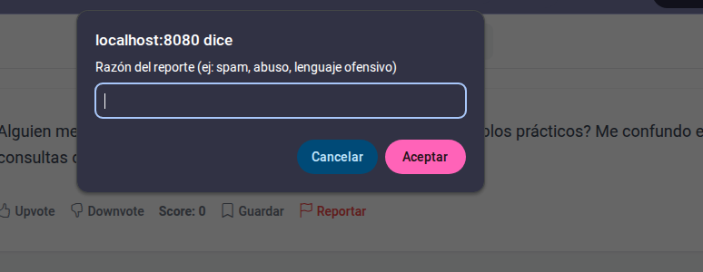
  
  **Por parte del admin se vera así los reportes**

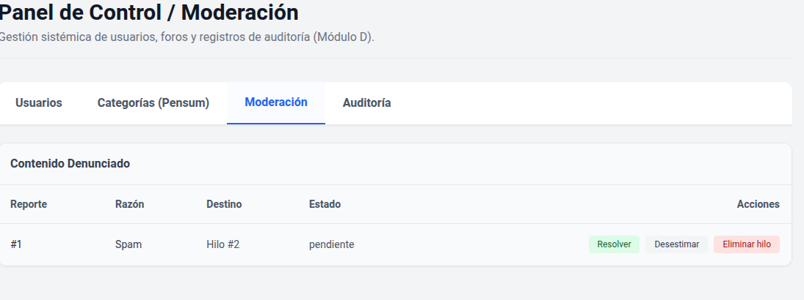

### 4.2 Sanciones

Recuerda que comportamientos indebidos pueden resultar en la **suspensión** de tu cuenta por parte de un administrador, detallando la razón y la duración de la misma.

**Vista desde admin:**

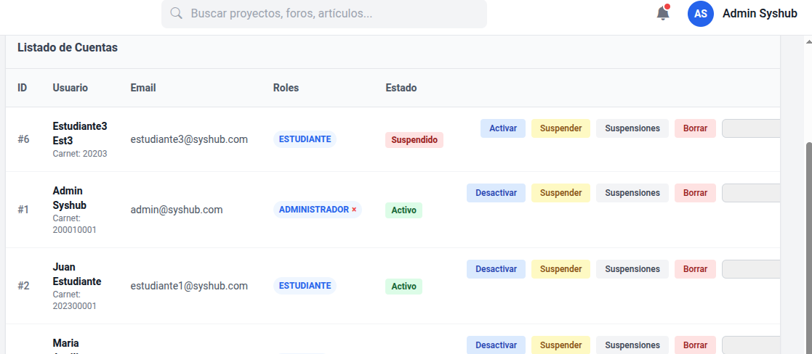

---

### Otras Funciones de Administrador

**El aministrador podra manjar el pensum o las categorias correspondientes por curso**

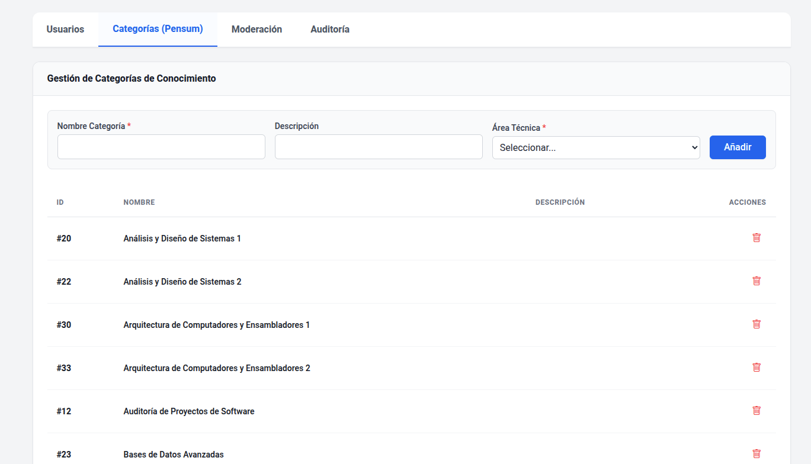

**Podra Auditar**

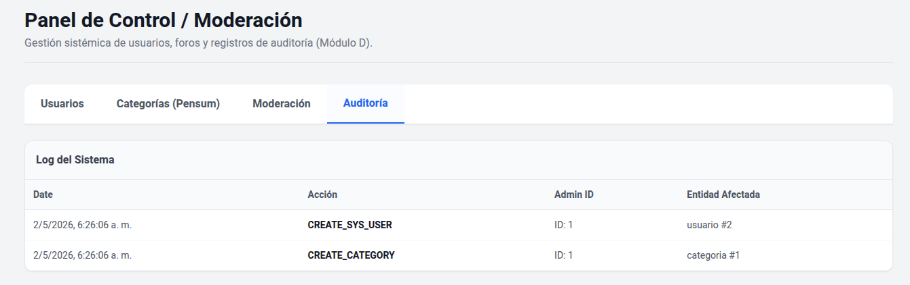

---

### Moderador

A diferencia del administrador, este rol, unicamente podra usar el panel de moderacion, de reportes,etc.

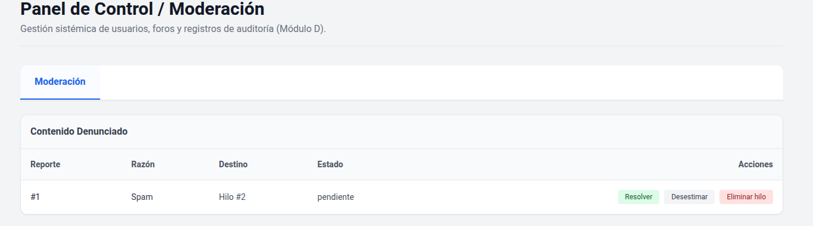

---

## 5. Glosario de Estados

- **Borrador**: Solo tú puedes verlo.

- **Pendiente**: Esperando revisión (en proyectos).

- **Publicado**: Visible para toda la comunidad.

- **Archivado**: Contenido antiguo que ya no acepta interacciones.